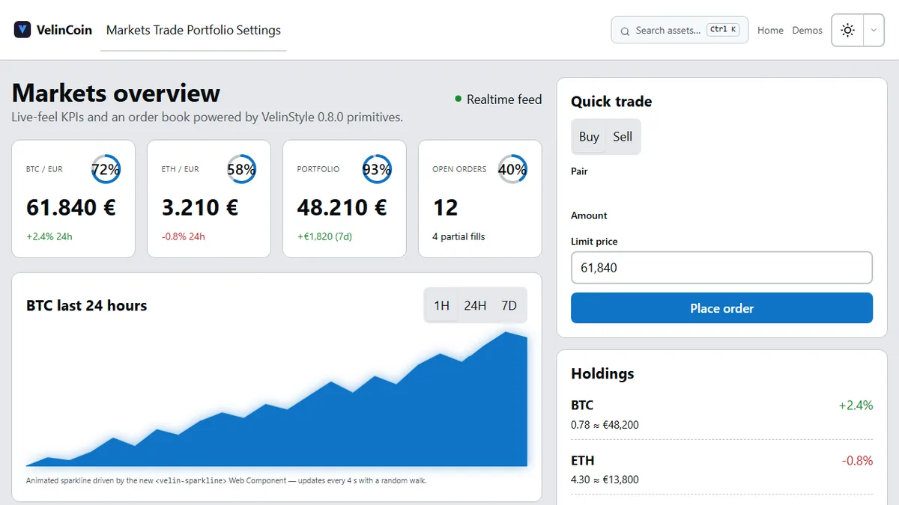
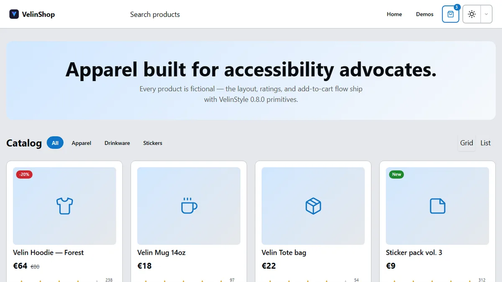
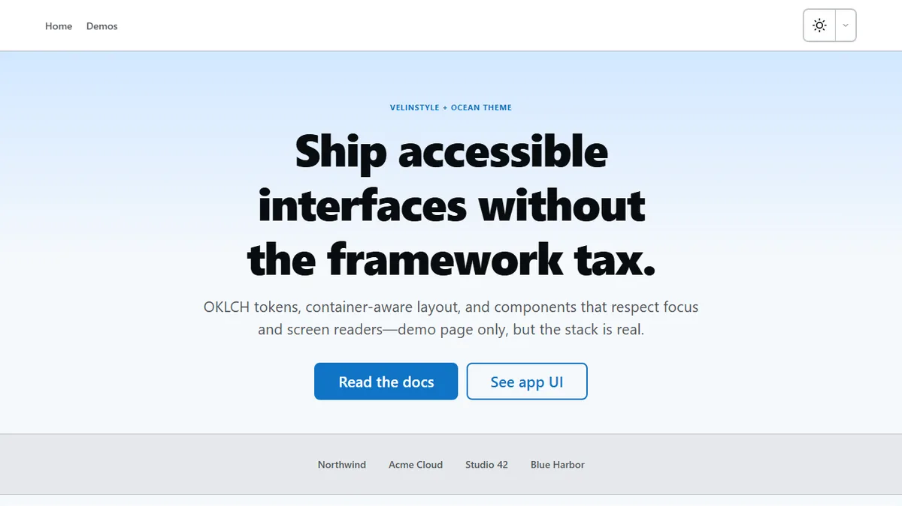
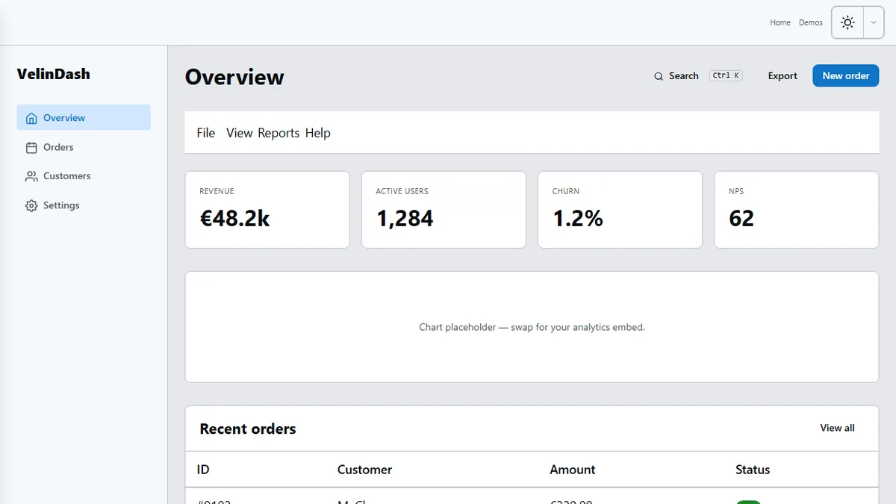
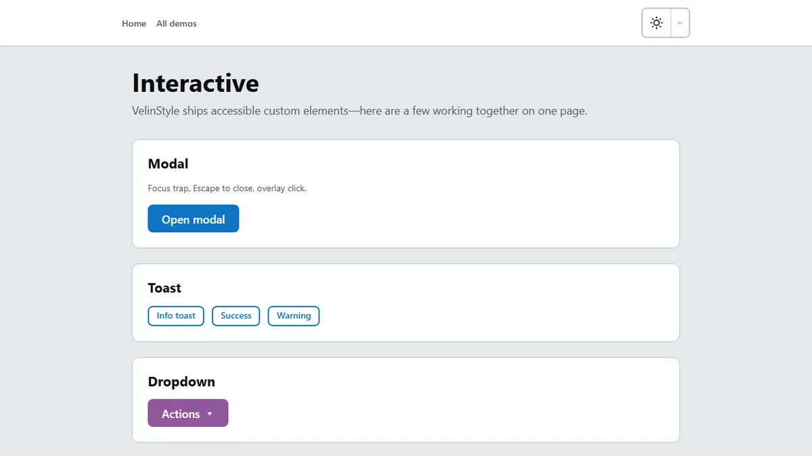
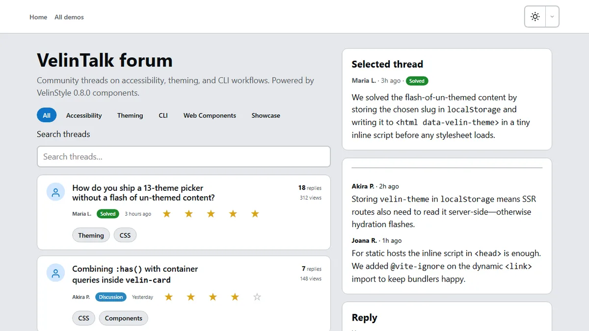

<div align="center">

<picture>
  <source media="(prefers-color-scheme: dark)" srcset=".github/assets/readme-banner-dark.svg">
  
</picture>

<br>

**WCAG 2.2 AA UI ohne Tailwind-Sprawl — modernes CSS + Web Components, in Minuten live.**

<br>

[](LICENSE)
[](https://github.com/SkyliteDesign/velinstyle/releases/tag/v0.8.0)
[](https://velinstyle.info/docs/)
[](https://www.npmjs.com/package/@birdapi/velinstyle)

<br>

```bash
npm i @birdapi/velinstyle
```

**[Live-Demos öffnen →](https://velinstyle.info/demos/)** · **[Full Pages forken →](https://github.com/SkyliteDesign/velinstyle/tree/main/showcase-demos)** · **[Doku](https://velinstyle.info/docs/)** · **[★ Stern](https://github.com/SkyliteDesign/velinstyle)**

**[English](README.md)** · **Deutsch**

<br>

<a href="https://velinstyle.info/demos/showcase-crypto.html">
  
</a>

</div>

---

## Live-Demos

Vollständige Anwendungsseiten — keine Spielzeug-Snippets. Live auf **[velinstyle.info](https://velinstyle.info/demos/)** oder **forken** aus **[velinstyle-demos](https://github.com/SkyliteDesign/velinstyle/tree/main/showcase-demos)** (ohne Build, unpkg CDN).

<table>
<tr>
<td width="50%" valign="top">

<a href="https://velinstyle.info/demos/showcase-crypto.html"></a>

### Crypto-Dashboard

Sparkline, Live-Counter, Command Palette, Menubar, Order Book — **0.8.0 Motion** auf Finance-UI.

**[Demo öffnen →](https://velinstyle.info/demos/showcase-crypto.html)** · **[Forken →](https://github.com/SkyliteDesign/velinstyle/blob/main/showcase-demos/demos/showcase-crypto.html)**

</td>
<td width="50%" valign="top">

<a href="https://velinstyle.info/demos/showcase-ecommerce.html"></a>

### E-Commerce

FLIP-Produktfilter, Cart-Sheet, Mobile Bottom-Nav, Segmented Sizes, Live-Announcer.

**[Demo öffnen →](https://velinstyle.info/demos/showcase-ecommerce.html)** · **[Forken →](https://github.com/SkyliteDesign/velinstyle/blob/main/showcase-demos/demos/showcase-ecommerce.html)**

</td>
</tr>
<tr>
<td width="50%" valign="top">

<a href="https://velinstyle.info/demos/showcase-saas.html"></a>

### SaaS-Marketing

Hero, Logos, Feature-Grid, Testimonial, Pricing — nur Layout-Utilities.

**[Demo öffnen →](https://velinstyle.info/demos/showcase-saas.html)** · **[Forken →](https://github.com/SkyliteDesign/velinstyle/blob/main/showcase-demos/demos/showcase-saas.html)**

</td>
<td width="50%" valign="top">

<a href="https://velinstyle.info/demos/showcase-dashboard.html"></a>

### Dashboard

App-Shell, KPI-Karten, Datentabelle, Drawer-Aktionen.

**[Demo öffnen →](https://velinstyle.info/demos/showcase-dashboard.html)** · **[Forken →](https://github.com/SkyliteDesign/velinstyle/blob/main/showcase-demos/demos/showcase-dashboard.html)**

</td>
</tr>
<tr>
<td width="50%" valign="top">

<a href="https://velinstyle.info/demos/showcase-interactive.html"></a>

### Interactive

Modal, Toast, Command Palette, Sheet, Stepper — **32 Web Components**.

**[Demo öffnen →](https://velinstyle.info/demos/showcase-interactive.html)** · **[Forken →](https://github.com/SkyliteDesign/velinstyle/blob/main/showcase-demos/demos/showcase-interactive.html)**

</td>
<td width="50%" valign="top">

<a href="https://velinstyle.info/demos/showcase-forum.html"></a>

### Forum

Threads, Ratings, Chips, Detail-Tabs, Mention-Composer.

**[Demo öffnen →](https://velinstyle.info/demos/showcase-forum.html)** · **[Forken →](https://github.com/SkyliteDesign/velinstyle/blob/main/showcase-demos/demos/showcase-forum.html)**

</td>
</tr>
</table>

<p align="center">
  <a href="https://velinstyle.info/demos/"><strong>Alle Demos (UI kit u. a.) →</strong></a>
  &nbsp;·&nbsp;
  <a href="https://skylitedesign.github.io/velinstyle/showcase-demos/"><strong>GitHub Pages Spiegel →</strong></a>
</p>

---

## Warum VelinStyle

- **Barrierefreiheit strukturell** — Fokus, ARIA, Tastatur in CSS + Web Components (WCAG 2.2 AA).
- **OKLCH-Tokens + 13 Themes** — perzeptuelle Farben, Dark Mode per `data-velin-theme`.
- **Ohne Build-Pflicht** — CSS + ESM einbinden; CLI optional.

---

## Schnellstart

```bash
npm install @birdapi/velinstyle
```

```html
<link rel="stylesheet" href="node_modules/@birdapi/velinstyle/dist/velinstyle.min.css">
<script type="module" src="node_modules/@birdapi/velinstyle/dist/velinstyle-components.min.js"></script>

<div class="velin-container velin-p-6">
  <button type="button" class="velin-btn velin-btn--primary">Loslegen</button>
</div>
```

<details>
<summary><strong>CDN · Motion · Repository klonen</strong></summary>

**CDN (0.8.0):**

```html
<link rel="stylesheet" href="https://unpkg.com/@birdapi/velinstyle@0.8.0/dist/velinstyle.min.css">
<script type="module" src="https://unpkg.com/@birdapi/velinstyle@0.8.0/dist/velinstyle-components.min.js"></script>
```

**Motion (0.8.0):**

```html
<html data-velin-reveal-auto>
  <velin-live-dot status="live">Live</velin-live-dot>
  <velin-counter from="0" to="12840" duration="900"></velin-counter>
  <velin-sparkline values="3,5,4,7,9" area glow animate="draw"></velin-sparkline>
</html>
```

**Klon:** `dist/` nicht im Repo — `npm install && npm run build`, oder [velinstyle-demos](https://github.com/SkyliteDesign/velinstyle/tree/main/showcase-demos) nur mit unpkg.

</details>

---

## vs Bootstrap · Tailwind · Shoelace

| | Bootstrap | Tailwind | Shoelace | **VelinStyle** |
| --- | :---: | :---: | :---: | :---: |
| A11y | Teilweise | DIY | Gute WC | **WCAG 2.2 AA by design** |
| Styling | Klassen | Utility JIT | Shadow WC | **CSS-Layer + Tokens** |
| Dark Mode | Manuell | `dark:` | Theme-Attr | **Token-Swap** |
| App-Chrome | Legacy JS | Eigenes JS | Nur WC | **CSS + 32 Web Components** |
| Full-Page-Demos | Basis | Keine offiziellen | Storybook | **[Live-Showcases](https://velinstyle.info/demos/)** |

---

## Built with VelinStyle

| | Link |
| --- | --- |
| **Produkt-Site** | [velinstyle.info](https://velinstyle.info) |
| **Dokumentation** | [velinstyle.info/docs/](https://velinstyle.info/docs/) |
| **Live-Demos** | [velinstyle.info/demos/](https://velinstyle.info/demos/) |
| **Forkbare Demos** | [github.com/SkyliteDesign/velinstyle-demos](https://github.com/SkyliteDesign/velinstyle/tree/main/showcase-demos) |
| **npm-Paket** | [@birdapi/velinstyle](https://www.npmjs.com/package/@birdapi/velinstyle) |
| **GitHub (Framework)** | [SkyliteDesign/velinstyle](https://github.com/SkyliteDesign/velinstyle) |

---

<details>
<summary><strong>CLI-Referenz</strong></summary>

Alle Befehle: `npx velinstyle <befehl>`

- **`init`** · **`build`** · **`themes`** · **`add`**
- **`icons`** · **`scan`** · **`scaffold`** · **`layout`** · **`blueprint`** · **`prefix`** · **`tokens build`**

Siehe [CHANGELOG 0.8.0](CHANGELOG.md#080---2026-05-16) und [docs/guides/](docs/guides/).

</details>

<details>
<summary><strong>Architektur &amp; lokale Samples</strong></summary>

Einstieg: [`src/velinstyle.css`](src/velinstyle.css) · **~150 KB CSS + ~111 KB JS** (min)

**Samples im Repo:** [samples/](samples/) · **Tools:** [Playground](tools/playground/index.html) · [Theme Builder](tools/theme-builder/index.html)

</details>

<details>
<summary><strong>Entwicklung</strong></summary>

```bash
npm install && npm run build && npm test
npm run demos:sync   # Showcases → velinstyle-demos
```

[CONTRIBUTING.de.md](CONTRIBUTING.de.md) · [SECURITY.md](SECURITY.md)

</details>

---

## Mitmachen

1. **[Stern dalassen](https://github.com/SkyliteDesign/velinstyle)**
2. **[Live-Demo](https://velinstyle.info/demos/)** testen und [velinstyle-demos](https://github.com/SkyliteDesign/velinstyle/tree/main/showcase-demos) forken
3. **Issue oder PR** — Feedback willkommen

---

## Lizenz

[MIT](LICENSE) — Copyright © 2026 VelinStyle

<div align="center">

Mit Sorgfalt fürs Web von [SkyliteDesign](https://github.com/SkyliteDesign)

</div>
