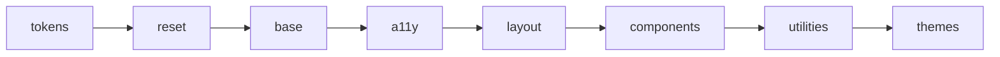

<div align="center">

<picture>
  <source media="(prefers-color-scheme: dark)" srcset=".github/assets/readme-banner-dark.svg">
  
</picture>

<br>

[](LICENSE)
[](https://github.com/SkyliteDesign/velinstyle/releases/tag/v0.8.0)
[](docs/a11y.html)
[]()
[]()
[](https://www.npmjs.com/package/@birdapi/velinstyle)
[](https://skylitedesign.github.io/velinstyle/)

[Dokumentation](https://skylitedesign.github.io/velinstyle/) · [npm](https://www.npmjs.com/package/@birdapi/velinstyle) · [Beispiele](samples/) · [Playground](tools/playground/index.html) · [Theme Builder](tools/theme-builder/index.html) · [Issues](https://github.com/SkyliteDesign/velinstyle/issues)

**[English](README.md)** · **Deutsch**

</div>

---

## Inhalt

- [Problem & Lösung](#the-problem--the-fix)
- [Das liefert VelinStyle](#what-you-get)
- [Architektur](#architecture)
- [Schnellstart](#quick-start)
- [Warum VelinStyle?](#why-velinstyle)
- [Demo-Galerie](#demo-gallery)
- [CLI-Referenz](#cli-reference)
- [Ökosystem](#ecosystem)
- [Mitmachen](#join-in)
- [Browser-Unterstützung](#browser-support)
- [Lizenz](#license)

---

## The problem & the fix

<table>
<tr>
<td width="50%" valign="top">

### Das Problem

Unter Zeitdruck landen **Barrierefreiheit** und **konsistentes Theming** oft erst am Ende—wenn überhaupt. Schwere Bundles, einheitlicher Bootstrap-Look oder Tailwind-Sprawl frustrieren Design und Engineering gleichermassen.

</td>
<td width="50%" valign="top">

### Die VelinStyle-Antwort

**WCAG-AA-Muster**, **OKLCH-Tokens**, **container-sensitives Layout** und **Web Components** gehören zum System—nicht als Nachrüstung. Lesbares CSS, optionale CLI, kein Preprocessor-Zwang.

</td>
</tr>
</table>

---

## What you get

<table>
<thead>
<tr><th></th><th>Funktion</th><th>Was du davon hast</th></tr>
</thead>
<tbody>
<tr><td align="center">♿</td><td><strong>WCAG AA by design</strong></td><td>Fokus, ARIA und Tastatur in Komponenten und Overlays</td></tr>
<tr><td align="center">🎨</td><td><strong>OKLCH + 13 Theme-Presets</strong></td><td>Perzeptuell gleichmässige Farben; Dark Mode per Token-Swap</td></tr>
<tr><td align="center">📦</td><td><strong>~150 KB CSS + ~111 KB JS (min)</strong></td><td>Komplettes Framework inkl. Komponenten-Bundle; weiterhin schlanker als viele All-in-One-Stacks</td></tr>
<tr><td align="center">📐</td><td><strong>Container Queries + Utilities</strong></td><td>Bausteine passen sich <em>ihrem</em> Container an, nicht nur dem Viewport</td></tr>
<tr><td align="center">🧩</td><td><strong>25 CSS-Module · 32 Web Components</strong></td><td>Modals, Sheets, Command Palette, Combobox, Rating—siehe <a href="docs/css-components.html">CSS</a> &amp; <a href="docs/components.html">WC-Docs</a></td></tr>
<tr><td align="center">📈</td><td><strong>Motion &amp; Charts (0.8.0)</strong></td><td><code>&lt;velin-sparkline&gt;</code>, <code>&lt;velin-counter&gt;</code>, <code>&lt;velin-live-dot&gt;</code>, FLIP-Listenfilter, Scroll-Reveal—<a href="CHANGELOG.md#080---2026-05-16">Changelog</a></td></tr>
<tr><td align="center">🛠️</td><td><strong>Optionale CLI</strong></td><td><code>init</code>, <code>build</code>, <code>icons</code>, <code>scan</code>, <code>prefix</code>, <code>blueprint</code>, <code>scaffold</code>, <code>layout</code>, <code>tokens build</code></td></tr>
<tr><td align="center">🌍</td><td><strong>RTL-ready</strong></td><td>Logical Properties und layout-orientierte Defaults · <a href="samples/rtl.html">RTL-Beispiel</a></td></tr>
</tbody>
</table>

---

## Architecture



Einstieg: [`src/velinstyle.css`](src/velinstyle.css) · Build-Ausgabe: `dist/` (`npm run build`)

```css
@layer tokens, reset, base, a11y, layout, components, utilities, themes;
```

---

## Quick start

### <span>①</span> Installation

```bash
npm install @birdapi/velinstyle
```

### <span>②</span> CSS + Komponenten einbinden (ES-Module)

```html
<link rel="stylesheet" href="node_modules/@birdapi/velinstyle/dist/velinstyle.min.css">
<script type="module" src="node_modules/@birdapi/velinstyle/dist/velinstyle-components.min.js"></script>
```

<details>
<summary><strong>CDN-Alternative</strong> (ohne npm install)</summary>

```html
<link rel="stylesheet" href="https://unpkg.com/@birdapi/velinstyle@0.8.0/dist/velinstyle.min.css">
<script type="module" src="https://unpkg.com/@birdapi/velinstyle@0.8.0/dist/velinstyle-components.min.js"></script>
```

</details>

### <span>③</span> Erste Oberfläche markupen

```html
<meta name="viewport" content="width=device-width, initial-scale=1">
<div class="velin-container velin-p-6">
  <p class="velin-lead velin-text-muted">Hallo, VelinStyle.</p>
  <button type="button" class="velin-btn velin-btn--primary">Primäre Aktion</button>
</div>
```

> **Repository klonen?** `dist/` liegt nicht im Repo. `npm install` und `npm run build`, dann HTML auf `dist/velinstyle.min.css` und `dist/velinstyle-components.min.js` zeigen. Ohne ES-Module: `velinstyle-components.iife.js` — siehe [Dokumentation](docs/index.html).

### <span>④</span> Motion &amp; Live-UI (0.8.0)

```html
<html data-velin-reveal-auto>
  <velin-live-dot status="live">Echtzeit</velin-live-dot>
  <velin-counter from="0" to="12840" duration="900"></velin-counter>
  <velin-sparkline values="3,5,4,7,9" area glow animate="draw" label="Trend"></velin-sparkline>
</html>
```

Scroll-Reveal startet automatisch mit dem Komponenten-Bundle. Für FLIP-gefilterte Listen: `data-velin-flip` am Container und `data-velin-filter-value` an den Chips—siehe [CHANGELOG](CHANGELOG.md#080---2026-05-16).

---

## Why VelinStyle?

Eine **einheitliche Produktsprache**—Präfix-Klassen (`velin-`), klare **`@layer`-Architektur**, modernes CSS (`@scope`, Nesting, `:has()`)—ohne **Liefergeschwindigkeit** zu opfern.

| | Bootstrap | Tailwind | **VelinStyle** |
| --- | :---: | :---: | :---: |
| A11y | ⚠️ Teilweise | — Nicht eingebaut | ✅ **WCAG AA strukturell** |
| Farben | HEX/RGB | HEX/RGB | ✅ **OKLCH** + tokenisierte Themes |
| Dark Mode | ⚠️ Build / manuell | `dark:`-Varianten | ✅ **Token-Swap** (`data-velin-theme`) |
| Layout | Viewport-first | Viewport-Utilities | ✅ **Container Queries** + Media |
| Interaktion | ⚠️ Legacy-JS-Muster | Eigenes JS | ✅ **Web Components** |
| Bundle (Richtwert) | ~230 KB CSS+JS | JIT / variabel | ✅ **~150 KB CSS + ~111 KB JS (min)** |
| Motion / Charts | — | — | ✅ **Sparkline, Counter, FLIP-Filter** |

---

## Demo gallery

| Demo | Seite | Demo | Seite |
| --- | --- | --- | --- |
| Landing | [samples/landing.html](samples/landing.html) | Dashboard | [samples/dashboard.html](samples/dashboard.html) |
| Login | [samples/login.html](samples/login.html) | Registrierung | [samples/signup.html](samples/signup.html) |
| Pricing | [samples/pricing.html](samples/pricing.html) | E-Commerce | [samples/ecommerce.html](samples/ecommerce.html) |
| Blog | [samples/blog.html](samples/blog.html) | Portfolio | [samples/portfolio.html](samples/portfolio.html) |
| Chat | [samples/chat.html](samples/chat.html) | E-Mail | [samples/email.html](samples/email.html) |
| Kanban | [samples/kanban.html](samples/kanban.html) | Einstellungen | [samples/settings.html](samples/settings.html) |
| RTL-Layout | [samples/rtl.html](samples/rtl.html) | A11y-Patterns | [samples/a11y-patterns.html](samples/a11y-patterns.html) |

| Tool | Seite |
| --- | --- |
| HTML-Playground | [tools/playground/index.html](tools/playground/index.html) |
| OKLCH Theme Builder | [tools/theme-builder/index.html](tools/theme-builder/index.html) |

---

## CLI reference

Alle Befehle: `npx velinstyle <befehl>` · `npx velinstyle --help`

<details>
<summary><strong>Projekt &amp; Build</strong> — <code>init</code>, <code>build</code>, <code>themes</code>, <code>add</code></summary>

- **`npx velinstyle init`** — erstellt `velinstyle.config.js` (Layer-Auswahl, Theme, Scan-Optionen).
- **`npx velinstyle build`** — CSS-Bundle aus gewählten Layern (`--output` / `-o`, `--minify`).
- **`npx velinstyle themes`** — listet 13 Theme-Presets.
- **`npx velinstyle add &lt;komponente&gt;`** — kopiert eine einzelne Komponenten-CSS-Datei ins Projekt.

</details>

<details>
<summary><strong>Icons</strong> — Multi-Provider-Sprite-Workflow</summary>

- **`npx velinstyle icons list`** — Lucide, Heroicons, Bootstrap Icons, Material Symbols, Font Awesome, Tabler.
- **`npx velinstyle icons add lucide --icons menu,search,check`**
- **`npx velinstyle icons add heroicons --icons arrow-left --variant outline`**
- **`npx velinstyle icons build`** — Sprite neu bauen (im VelinStyle-Klon: schreibt `icons/svg/` und baut neu).

</details>

<details>
<summary><strong>scan</strong> — Security, A11y &amp; CSS-Lint</summary>

- **`npx velinstyle scan [pfad]`** — HTML, CSS, JS; **`--format json`** für CI.
- **`--severity`** — Mindest-Stufe filtern: `error` | `warning` | `info`.
- **`--fix`** — nur sichere Auto-Fixes; **`--fix-dry-run`** listet Dateien ohne Schreiben.
- **`--fix-lang`** — BCP 47 für `lang` auf `<html>` (Standard `de`).

**Auto-Fixes (Auszug):** `rel="noopener noreferrer"` bei riskantem `target="_blank"`; `lang` auf `<html>`; Skip-Link wenn `id="main"` existiert; rohe `z-index` → `--velin-z-*`.

**Nicht automatisch:** `javascript:`-URLs, `eval`, rohes `innerHTML`, Inline-Event-Handler — im Code bereinigen.

**Trusted Types / XSS:** Der Scanner ersetzt keine CSP-Policies. Web Components nutzen `escapeHTML()` / `sanitizeURL()`; siehe [docs/security.html](docs/security.html).

</details>

<details>
<summary><strong>prefix</strong> — Klassen-Codemod &amp; JSON-Maps</summary>

- **`npx velinstyle prefix &lt;ordner&gt;`** — Standard: Dry-Run; **`--write`** schreibt Änderungen.
- **`--bootstrap-display`** — mappt Bootstrap-`d-*` auf Velin-Display-Klassen.
- **`velinstyle-prefix-map.json`** im Zielordner oder **`--map datei.json`** — explizite Token → Klassen (überschreibt Katalog und Bootstrap-Aliase). Beispiel: [examples/velinstyle-prefix-map.sample.json](examples/velinstyle-prefix-map.sample.json).

</details>

<details>
<summary><strong>scaffold</strong> — Prompt → HTML (0.8.0)</summary>

- **`npx velinstyle scaffold list-intents`**
- **`npx velinstyle scaffold "Navbar mit Suche" -o nav.html`**
- **`npx velinstyle scaffold "…" --json`** — für Agenten/CI

Siehe [docs/guides/prompt-scaffolding.html](docs/guides/prompt-scaffolding.html).

</details>

<details>
<summary><strong>layout</strong> — Responsive-Audit (0.8.0)</summary>

- **`npx velinstyle layout audit [pfad]`**
- **`npx velinstyle layout suggest [pfad]`**
- **`npx velinstyle layout fix [pfad] --write`**

Siehe [docs/guides/responsive-layout.html](docs/guides/responsive-layout.html).

</details>

<details>
<summary><strong>blueprint</strong> — 22 HTML-Snippets</summary>

- **`npx velinstyle blueprint list`**
- **`npx velinstyle blueprint &lt;name&gt; -o datei.html`**

Ids u. a. `modal`, `form-login`, `layout-dashboard`, `navbar-header`, `filter-bar`, `bottom-nav-mobile`, `cookie-consent`, `notification-center`, `onboarding`, `pricing-table`, `empty-state`—vollständige Liste mit `blueprint list`.

</details>

<details>
<summary><strong>tokens build</strong> — Design-Tokens → CSS</summary>

```bash
npx velinstyle tokens build --input examples/tokens.sample.json -o tokens.css
```

</details>

---

## Ecosystem

<table>
<tr>
<td width="50%" valign="top">

**Starter &amp; Pakete**

- [templates/vite-velinstyle](templates/vite-velinstyle) — Vite + 3 Seiten + Theme-Toggle
- [templates/vite-react-velinstyle](templates/vite-react-velinstyle) — Vite + React-Starter
- [@velinstyle/react](packages/react) — experimentelle dünne React-Wrapper

**Dokumentation**

- [Erste Schritte](docs/getting-started.html) · [Migration](docs/migration.html) · [CHANGELOG](CHANGELOG.md#080---2026-05-16)
- [A11y-Patterns](docs/a11y-patterns/index.html) · [Security](docs/security.html)
- [Prompt-Scaffolding](docs/guides/prompt-scaffolding.html) · [Responsive Layout-Audit](docs/guides/responsive-layout.html)

</td>
<td width="50%" valign="top">

**Entwicklung (dieses Repo)**

```bash
npm install
npm run dev      # Serve auf :3000
npm run build
npm test
npm run test:a11y
```

**Themes (13):** `brutalist`, `corporate`, `earth`, `forest`, `midnight`, `neon`, `nordic`, `ocean`, `pastel`, `retro`, `sharp`, `soft`, `sunset` — siehe [docs/themes.html](docs/themes.html).

</td>
</tr>
</table>

<!-- Maintainer: .github/social-preview.png (1280×640) unter Settings → Social preview -->

---

## Join in

Wenn VelinStyle dir Zeit spart oder die Latte für inklusive UI hebt:

1. **Stern dalassen**, damit andere das Projekt finden.
2. **Issue öffnen** mit Feedback, Grenzfällen oder Ideen.
3. **Pull Request** nach [CONTRIBUTING.de.md](CONTRIBUTING.de.md).

Maintainer: [RELEASING.md](RELEASING.md) · [SECURITY.md](SECURITY.md)

---

## Browser support

VelinStyle ist **mobile-first**. Nutze einen **aktuellen Evergreen-Browser** (aktuelles Safari unter iOS, Chrome/Firefox unter Android und Desktop). OKLCH, Container Queries, `@layer` und Web Components brauchen moderne Engines. Viewport-`meta` für Mobile nicht vergessen. Ältere In-App-WebViews können Farben oder Layout falsch darstellen.

---

## License

[MIT](LICENSE) — Copyright © 2026 VelinStyle

---

<div align="center">

Mit Sorgfalt fürs Web von [SkyliteDesign](https://github.com/SkyliteDesign)

</div>
