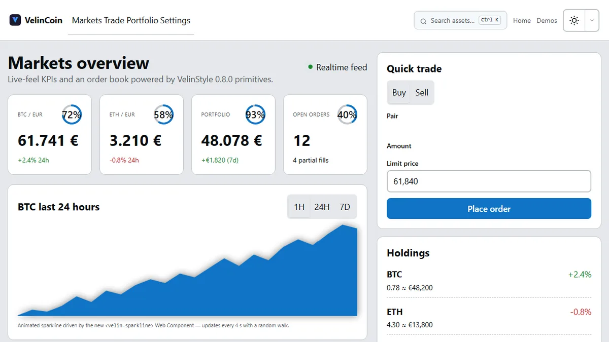

<div align="center">

```
██╗   ██╗███████╗██╗     ██╗███╗   ██╗███████╗████████╗██╗  ██╗██╗     ███████╗
██║   ██║██╔════╝██║     ██║████╗  ██║██╔════╝╚══██╔══╝██║  ██║██║     ██╔════╝
██║   ██║█████╗  ██║     ██║██╔██╗ ██║███████╗   ██║   ███████║██║     █████╗
╚██╗ ██╔╝██╔══╝  ██║     ██║██║╚██╗██║╚════██║   ██║   ██╔══██║██║     ██╔══╝
 ╚████╔╝ ███████╗███████╗██║██║ ╚████║███████║   ██║   ██║  ██║███████╗███████╗
  ╚═══╝  ╚══════╝╚══════╝╚═╝╚═╝  ╚═══╝╚══════╝   ╚═╝   ╚═╝  ╚═╝╚══════╝╚══════╝
```

[](LICENSE)
[](https://github.com/SkyliteDesign/velinstyle/releases/tag/v0.9.0)
[](https://www.npmjs.com/package/@birdapi/velinstyle)
[](https://velinstyle.info/docs/a11y.html)
[](https://github.com/SkyliteDesign/velinstyle/stargazers)
[](CONTRIBUTING.md)

```bash
npm i @birdapi/velinstyle
```

**[Website](https://velinstyle.info)** · **[Docs](https://velinstyle.info/docs/)** · **[Demos](https://velinstyle.info/demos/)** · **[npm](https://www.npmjs.com/package/@birdapi/velinstyle)** · **[Star on GitHub](https://github.com/SkyliteDesign/velinstyle)**

**English** · **[Deutsch](README.de.md)**

</div>

---

**VelinStyle** is the **WCAG 2.2 AAA CSS framework** with native JavaScript runtime and Web Components — CSS utilities, 0.9.0 modules (search, motion, highlight, attributes, meta), and security tooling, with **no external UI framework dependencies** in the core.

Built for teams who want **readable HTML**, **AAA token defaults** (AA via `data-velin-contrast="aa"`), and **CLI automation** instead of utility sprawl.

> **Dogfooding:** The entire VelinStyle website and documentation runs 100% on VelinStyle — no external scripts or UI frameworks.

---

## Features at a glance

- **CSS utilities** — `velin-*` spacing, color, flex, motion, safe-area; cascade layers + OKLCH tokens
- **35+ components** — semantic BEM classes (`velin-btn`, `velin-card`, `velin-grid`, …)
- **Motion runtime** — reveal, stagger, scroll-driven animation, rAF scheduler
- **VelinSearch** — fuzzy offline search with highlighting and categories
- **Syntax highlighting** — lazy in-view highlighting for JS, HTML, CSS, JSON, and more
- **HTML attributes** — 27 declarative bridges (`velin-modal`, `velin-reveal`, `velin-scroll-top`, `velin-code`, …)
- **Quality** — 36/36 component a11y contracts, Playwright cross-browser smoke (`npm run test:e2e`), CLS placeholders (`wc-placeholder.css`)
- **Security tools** — `scan`, PII rules, sanitize API, hardened components
- **CLI** — init, build, scan, scaffold, tokens, docs generate, perf audit, layout audit
- **Velin-Meta** — `velin-agent.json`, `llms.txt`, and page-level agent JSON for AI assistants

---

## Installation

```bash
npm i @birdapi/velinstyle
```

| Path | Use |
| --- | --- |
| `@birdapi/velinstyle/css` | Full minified stylesheet |
| `@birdapi/velinstyle/bundle` | Web Components ESM bundle |
| `@birdapi/velinstyle/search` | VelinSearch module |
| `@birdapi/velinstyle/motion` | Motion runtime |
| `@birdapi/velinstyle/attributes` | HTML attribute bridges |
| `@birdapi/velinstyle/highlight` | Syntax highlighting |
| `@birdapi/velinstyle/meta` | Agent metadata API |

**CDN (pin version):**

```html
<link rel="stylesheet" href="https://unpkg.com/@birdapi/velinstyle@0.9.0/dist/velinstyle.min.css">
<script type="module" src="https://unpkg.com/@birdapi/velinstyle@0.9.0/dist/velinstyle-components.min.js"></script>
```

After cloning, run `npm install && npm run build` — `dist/` is generated, not committed.

---

## Quickstart

```html
<!DOCTYPE html>
<html lang="en" data-velin-theme="ocean">
<head>
  <meta charset="UTF-8">
  <meta name="viewport" content="width=device-width, initial-scale=1">
  <link rel="stylesheet" href="https://unpkg.com/@birdapi/velinstyle@0.9.0/dist/velinstyle.min.css">
  <script type="module" src="https://unpkg.com/@birdapi/velinstyle@0.9.0/dist/velinstyle-components.min.js"></script>
</head>
<body class="velin-p-6">
  <button type="button" class="velin-btn velin-btn--primary" velin-reveal="slide-up">Ship it</button>
  <velin-code-block language="html" line-numbers>&lt;p class="velin-text-muted"&gt;Hello VelinStyle&lt;/p&gt;</velin-code-block>
</body>
</html>
```

---

## Core modules (0.9.0)

| Export | Description |
| --- | --- |
| `@birdapi/velinstyle/search` | Fuzzy offline search, providers, optional Web Worker |
| `@birdapi/velinstyle/motion` | `initMotion`, stagger, smooth scroll, unified `.velin-in-view` |
| `@birdapi/velinstyle/attributes` | Registry of declarative `velin-*` HTML attribute bridges |
| `@birdapi/velinstyle/highlight` | `velinSyntax`, lazy language packs, OKLCH token colors |
| `@birdapi/velinstyle/meta` | `buildAgentBundle`, page meta MIME `application/vnd.velinstyle.meta+json` |

---

## Web Components

**36 canonical** custom elements (38 lazy-loader entries including legacy `velin-tooltip-wc` and `velin-stepper-wc`) — use plain CSS when you do not need behavior. `src/base/wc-placeholder.css` reduces layout shift before elements upgrade.

Examples: `velin-modal`, `velin-search`, `velin-code-block`, `velin-drawer`, `velin-stepper`, `velin-tooltip`, `velin-toast`, `velin-persist`.

- [Component documentation](https://velinstyle.info/docs/components/buttons.html)
- [Generated Web Component API](https://velinstyle.info/docs/generated/components/README.md)

---

## CLI

| Command | Purpose |
| --- | --- |
| `npx velinstyle init` | Create `velinstyle.config.js` in your project |
| `npx velinstyle scan` | Security, accessibility, CSS, and PII checks |
| `npx velinstyle search index` | Build `dist/search-index.json` for offline doc search |
| `npx velinstyle tokens build` | Compile design tokens JSON to CSS |
| `npx velinstyle meta` | Generate `velin-agent.json` and `llms.txt` |

Also: `npx velinstyle docs generate` — Markdown reference under `docs/generated/`.

---

## Security

VelinStyle ships **first-class security tooling**, not an afterthought:

- **`velinstyle scan`** — markup and a11y rules; PII scanner (`--only pii`, `--fix`)
- **`@birdapi/velinstyle/sanitize`** — URL and text sanitization helpers
- **`<velin-secure-field>`** — no plaintext secrets in the DOM; hardened search/copy URLs

[Security documentation](https://velinstyle.info/docs/extend/security.html)

---

## Velin-Meta

Machine-readable context for **Cursor, Copilot, and custom agents**:

- **Global bundle** — `dist/velin-agent.json` + `dist/llms.txt` via `velinstyle meta`
- **Page-level meta** — `<script type="application/vnd.velinstyle.meta+json" id="velin-meta">`
- **CLI** — `velinstyle meta page my.html --write`

[Velin-Meta guide](https://velinstyle.info/docs/guides/velin-meta.html)

---

## Docs & website

- [velinstyle.info](https://velinstyle.info) — product site and demos
- [Guides](https://velinstyle.info/docs/guides/index.html) · [Feature scope](https://velinstyle.info/docs/guides/feature-scope.html)
- [API reference](https://velinstyle.info/docs/guides/api-reference.html) — generated from source
- [Generated Markdown](https://velinstyle.info/docs/generated/index.html) — components, tokens, utilities, CLI, rules

---

## Changelog

See [CHANGELOG.md](CHANGELOG.md) for releases, breaking changes, and migration notes.

---

## Comparison

| | Bootstrap | Tailwind | Shoelace | **VelinStyle** |
| --- | :---: | :---: | :---: | :---: |
| HTML readability | Medium | Low | Medium | **High** |
| Class predictability | Medium | Low | Medium | **`velin-btn--primary`** |
| Utility sprawl | Low | **High** | Low | **Controlled** |
| Override story | Hard | Config file | Shadow DOM | **CSS layers + tokens** |
| Accessibility | Partial | DIY | Good WC | **WCAG 2.2 AAA tokens** |
| Dark mode | Manual | `dark:` everywhere | Theme attr | **Token swap** |
| App chrome | Legacy JS | BYO | WC only | **CSS + optional WCs** |
| Ship speed | Fast | Fast (with build) | Fast | **CDN, no build required** |
| Runtime modules | — | — | — | **Search, motion, meta, …** |

---

## Live demos

Full application pages on [velinstyle.info/demos/](https://velinstyle.info/demos/) — [Crypto](https://velinstyle.info/demos/showcase-crypto.html) · [E-Commerce](https://velinstyle.info/demos/showcase-ecommerce.html) · [Dashboard](https://velinstyle.info/demos/showcase-dashboard.html) · [All demos](https://velinstyle.info/demos/) · [Fork showcase-demos](https://github.com/SkyliteDesign/velinstyle/tree/main/showcase-demos)

<p align="center">
  <a href="https://velinstyle.info/demos/showcase-crypto.html">
    
  </a>
</p>

---

## Contributing

PRs welcome.

1. Fork the repo
2. `npm install && npm run build`
3. Make your change · run `npm test`, `npm run test:a11y`, and `npm run test:e2e` (after `npm run build`)
4. Open a pull request

See [CONTRIBUTING.md](CONTRIBUTING.md) for code style and review process.

---

## License

[MIT](LICENSE) — Copyright © 2026 VelinStyle

<div align="center">

Made with care for the web by [SkyliteDesign](https://github.com/SkyliteDesign)

</div>
