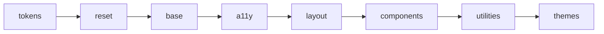

<div align="center">

<picture>
  <source media="(prefers-color-scheme: dark)" srcset=".github/assets/readme-banner-dark.svg">
  
</picture>

<br>

[](LICENSE)
[](https://github.com/SkyliteDesign/velinstyle/releases/tag/v0.8.0)
[](docs/a11y.html)
[]()
[]()
[](https://www.npmjs.com/package/@birdapi/velinstyle)
[](https://skylitedesign.github.io/velinstyle/)

[Documentation](https://skylitedesign.github.io/velinstyle/) · [npm](https://www.npmjs.com/package/@birdapi/velinstyle) · [Samples](samples/) · [Playground](tools/playground/index.html) · [Theme Builder](tools/theme-builder/index.html) · [Issues](https://github.com/SkyliteDesign/velinstyle/issues)

**English** · **[Deutsch](README.de.md)**

</div>

---

## Contents

- [The problem & the fix](#the-problem--the-fix)
- [What you get](#what-you-get)
- [Architecture](#architecture)
- [Quick start](#quick-start)
- [Why VelinStyle?](#why-velinstyle)
- [Demo gallery](#demo-gallery)
- [CLI reference](#cli-reference)
- [Ecosystem](#ecosystem)
- [Join in](#join-in)
- [Browser support](#browser-support)
- [License](#license)

---

## The problem & the fix

<table>
<tr>
<td width="50%" valign="top">

### The problem

Teams ship UI under pressure. **Accessibility** and **consistent theming** are often bolted on late—if at all. Heavy bundles, Bootstrap sameness, or Tailwind sprawl frustrate designers and engineers alike.

</td>
<td width="50%" valign="top">

### The VelinStyle answer

**WCAG AA patterns**, **OKLCH tokens**, **container-aware layout**, and **interactive Web Components** are part of the system—not an afterthought. Readable CSS, optional CLI automation, zero preprocessor lock-in.

</td>
</tr>
</table>

---

## What you get

<table>
<thead>
<tr><th></th><th>Capability</th><th>What it means for you</th></tr>
</thead>
<tbody>
<tr><td align="center">♿</td><td><strong>WCAG AA by design</strong></td><td>Focus, ARIA, and keyboard patterns in components and overlays</td></tr>
<tr><td align="center">🎨</td><td><strong>OKLCH + 13 theme presets</strong></td><td>Perceptually uniform colors; dark mode via token swap</td></tr>
<tr><td align="center">📦</td><td><strong>~150 KB CSS + ~111 KB JS (min)</strong></td><td>Full framework + components bundle; still lean vs. all-in-one stacks</td></tr>
<tr><td align="center">📐</td><td><strong>Container Queries + utilities</strong></td><td>Components adapt to <em>their</em> container, not only the viewport</td></tr>
<tr><td align="center">🧩</td><td><strong>25 CSS modules · 32 Web Components</strong></td><td>Modals, sheets, command palette, combobox, rating—see <a href="docs/css-components.html">CSS</a> &amp; <a href="docs/components.html">WC docs</a></td></tr>
<tr><td align="center">📈</td><td><strong>Motion &amp; charts (0.8.0)</strong></td><td><code>&lt;velin-sparkline&gt;</code>, <code>&lt;velin-counter&gt;</code>, <code>&lt;velin-live-dot&gt;</code>, FLIP list filtering, scroll reveal—<a href="CHANGELOG.md#080---2026-05-16">changelog</a></td></tr>
<tr><td align="center">🛠️</td><td><strong>Optional CLI</strong></td><td><code>init</code>, <code>build</code>, <code>icons</code>, <code>scan</code>, <code>prefix</code>, <code>blueprint</code>, <code>scaffold</code>, <code>layout</code>, <code>tokens build</code></td></tr>
<tr><td align="center">🌍</td><td><strong>RTL-ready</strong></td><td>Logical properties and layout-minded defaults · <a href="samples/rtl.html">RTL sample</a></td></tr>
</tbody>
</table>

---

## Architecture



Entry: [`src/velinstyle.css`](src/velinstyle.css) · Build output: `dist/` (`npm run build`)

```css
@layer tokens, reset, base, a11y, layout, components, utilities, themes;
```

---

## Quick start

### <span>①</span> Install

```bash
npm install @birdapi/velinstyle
```

### <span>②</span> Link CSS + components (ES modules)

```html
<link rel="stylesheet" href="node_modules/@birdapi/velinstyle/dist/velinstyle.min.css">
<script type="module" src="node_modules/@birdapi/velinstyle/dist/velinstyle-components.min.js"></script>
```

<details>
<summary><strong>CDN alternative</strong> (skip npm install)</summary>

```html
<link rel="stylesheet" href="https://unpkg.com/@birdapi/velinstyle@0.8.0/dist/velinstyle.min.css">
<script type="module" src="https://unpkg.com/@birdapi/velinstyle@0.8.0/dist/velinstyle-components.min.js"></script>
```

</details>

### <span>③</span> Mark up your first screen

```html
<meta name="viewport" content="width=device-width, initial-scale=1">
<div class="velin-container velin-p-6">
  <p class="velin-lead velin-text-muted">Hello, VelinStyle.</p>
  <button type="button" class="velin-btn velin-btn--primary">Primary action</button>
</div>
```

> **Cloning this repo?** `dist/` is not committed. Run `npm install` and `npm run build`, then point HTML at `dist/velinstyle.min.css` and `dist/velinstyle-components.min.js`. Legacy pages without modules: `velinstyle-components.iife.js` — see [docs](docs/index.html).

### <span>④</span> Motion &amp; live UI (0.8.0)

```html
<html data-velin-reveal-auto>
  <velin-live-dot status="live">Realtime</velin-live-dot>
  <velin-counter from="0" to="12840" duration="900"></velin-counter>
  <velin-sparkline values="3,5,4,7,9" area glow animate="draw" label="Trend"></velin-sparkline>
</html>
```

Scroll reveal auto-inits from the component bundle. For FLIP-filtered lists, add `data-velin-flip` on the container and `data-velin-filter-value` on chips—see [CHANGELOG](CHANGELOG.md#080---2026-05-16).

---

## Why VelinStyle?

A **coherent product language**—prefix classes (`velin-`), explicit `@layer` architecture, modern CSS (`@scope`, nesting, `:has()`)—without sacrificing **ship speed**.

| | Bootstrap | Tailwind | **VelinStyle** |
| --- | :---: | :---: | :---: |
| A11y | ⚠️ Partial | — Not built-in | ✅ **WCAG AA structurally** |
| Color | HEX/RGB | HEX/RGB | ✅ **OKLCH** + tokenized themes |
| Dark mode | ⚠️ Build / manual | `dark:` variants | ✅ **Token swap** (`data-velin-theme`) |
| Layout | Viewport-first | Viewport utilities | ✅ **Container Queries** + media |
| Interactivity | ⚠️ Legacy JS patterns | Bring your own | ✅ **Web Components** |
| Bundle (indicative) | ~230 KB CSS+JS | JIT / varies | ✅ **~150 KB CSS + ~111 KB JS (min)** |
| Motion / charts | — | — | ✅ **Sparkline, counter, FLIP filter** |

---

## Demo gallery

| Demo | Page | Demo | Page |
| --- | --- | --- | --- |
| Landing | [samples/landing.html](samples/landing.html) | Dashboard | [samples/dashboard.html](samples/dashboard.html) |
| Login | [samples/login.html](samples/login.html) | Sign up | [samples/signup.html](samples/signup.html) |
| Pricing | [samples/pricing.html](samples/pricing.html) | E-commerce | [samples/ecommerce.html](samples/ecommerce.html) |
| Blog | [samples/blog.html](samples/blog.html) | Portfolio | [samples/portfolio.html](samples/portfolio.html) |
| Chat | [samples/chat.html](samples/chat.html) | Email | [samples/email.html](samples/email.html) |
| Kanban | [samples/kanban.html](samples/kanban.html) | Settings | [samples/settings.html](samples/settings.html) |
| RTL layout | [samples/rtl.html](samples/rtl.html) | A11y patterns | [samples/a11y-patterns.html](samples/a11y-patterns.html) |

| Tool | Page |
| --- | --- |
| HTML playground | [tools/playground/index.html](tools/playground/index.html) |
| OKLCH theme builder | [tools/theme-builder/index.html](tools/theme-builder/index.html) |

---

## CLI reference

All commands: `npx velinstyle <command>` · `npx velinstyle --help`

<details>
<summary><strong>Project &amp; build</strong> — <code>init</code>, <code>build</code>, <code>themes</code>, <code>add</code></summary>

- **`npx velinstyle init`** — creates `velinstyle.config.js` (layer selection, theme, scan options).
- **`npx velinstyle build`** — custom CSS bundle from selected layers (`--output` / `-o`, `--minify`).
- **`npx velinstyle themes`** — lists 13 theme presets.
- **`npx velinstyle add &lt;component&gt;`** — copies a single component CSS file into your project.

</details>

<details>
<summary><strong>Icons</strong> — multi-provider sprite workflow</summary>

- **`npx velinstyle icons list`** — Lucide, Heroicons, Bootstrap Icons, Material Symbols, Font Awesome, Tabler.
- **`npx velinstyle icons add lucide --icons menu,search,check`**
- **`npx velinstyle icons add heroicons --icons arrow-left --variant outline`**
- **`npx velinstyle icons build`** — rebuilds sprite (from a VelinStyle clone: writes `icons/svg/` and rebuilds).

</details>

<details>
<summary><strong>scan</strong> — security, a11y &amp; CSS lint</summary>

- **`npx velinstyle scan [path]`** — HTML, CSS, JS; **`--format json`** for CI.
- **`--severity`** — filter minimum level: `error` | `warning` | `info`.
- **`--fix`** — safe auto-fixes only; **`--fix-dry-run`** lists files without writing.
- **`--fix-lang`** — BCP 47 for setting `lang` on `<html>` (default `en`).

**Auto-fixes (examples):** `rel="noopener noreferrer"` on risky `target="_blank"`; `lang` on `<html>`; skip link when `id="main"` exists; raw `z-index` → `--velin-z-*`.

**Not auto-fixed:** `javascript:` URLs, `eval`, raw `innerHTML`, inline event handlers — fix in source.

**Trusted Types / XSS:** the scanner does not replace CSP policies. Web Components use `escapeHTML()` / `sanitizeURL()`; see [docs/security.html](docs/security.html).

</details>

<details>
<summary><strong>prefix</strong> — class codemod &amp; JSON maps</summary>

- **`npx velinstyle prefix &lt;folder&gt;`** — dry-run by default; **`--write`** applies changes.
- **`--bootstrap-display`** — maps Bootstrap `d-*` to Velin display classes.
- **`velinstyle-prefix-map.json`** in the target folder or **`--map file.json`** — explicit token → class mappings (overrides catalog and Bootstrap aliases). Sample: [examples/velinstyle-prefix-map.sample.json](examples/velinstyle-prefix-map.sample.json).

</details>

<details>
<summary><strong>scaffold</strong> — prompt → HTML (0.8.0)</summary>

- **`npx velinstyle scaffold list-intents`**
- **`npx velinstyle scaffold "Navbar with search" -o nav.html`**
- **`npx velinstyle scaffold "…" --json`** — for agents/CI

See [docs/guides/prompt-scaffolding.html](docs/guides/prompt-scaffolding.html).

</details>

<details>
<summary><strong>layout</strong> — responsive audit (0.8.0)</summary>

- **`npx velinstyle layout audit [path]`**
- **`npx velinstyle layout suggest [path]`**
- **`npx velinstyle layout fix [path] --write`**

See [docs/guides/responsive-layout.html](docs/guides/responsive-layout.html).

</details>

<details>
<summary><strong>blueprint</strong> — 22 HTML snippets</summary>

- **`npx velinstyle blueprint list`**
- **`npx velinstyle blueprint &lt;name&gt; -o snippet.html`**

Ids include `modal`, `form-login`, `layout-dashboard`, `navbar-header`, `filter-bar`, `bottom-nav-mobile`, `cookie-consent`, `notification-center`, `onboarding`, `pricing-table`, `empty-state`, and more—run `blueprint list` for the full set.

</details>

<details>
<summary><strong>tokens build</strong> — design tokens → CSS</summary>

```bash
npx velinstyle tokens build --input examples/tokens.sample.json -o tokens-out.css
```

</details>

---

## Ecosystem

<table>
<tr>
<td width="50%" valign="top">

**Starters &amp; packages**

- [templates/vite-velinstyle](templates/vite-velinstyle) — Vite + 3 pages + theme toggle
- [templates/vite-react-velinstyle](templates/vite-react-velinstyle) — Vite + React starter
- [@velinstyle/react](packages/react) — experimental thin React wrappers

**Docs**

- [Getting started](docs/getting-started.html) · [Migration](docs/migration.html) · [CHANGELOG](CHANGELOG.md#080---2026-05-16)
- [A11y patterns](docs/a11y-patterns/index.html) · [Security](docs/security.html)
- [Prompt scaffolding](docs/guides/prompt-scaffolding.html) · [Responsive layout audit](docs/guides/responsive-layout.html)

</td>
<td width="50%" valign="top">

**Development (this repo)**

```bash
npm install
npm run dev      # serve on :3000
npm run build
npm test
npm run test:a11y
```

**Themes (13):** `brutalist`, `corporate`, `earth`, `forest`, `midnight`, `neon`, `nordic`, `ocean`, `pastel`, `retro`, `sharp`, `soft`, `sunset` — see [docs/themes.html](docs/themes.html).

</td>
</tr>
</table>

<!-- Maintainers: add .github/social-preview.png (1280×640) in repo Settings → Social preview -->

---

## Join in

If VelinStyle saves you time or raises the bar for inclusive UI:

1. **Star the repo** so others discover it.
2. **Open an issue** with feedback, edge cases, or ideas.
3. **Open a PR** following [CONTRIBUTING.md](CONTRIBUTING.md).

Maintainers: [RELEASING.md](RELEASING.md) · [SECURITY.md](SECURITY.md)

---

## Browser support

VelinStyle is **mobile-first**. Use a **current evergreen browser** (recent Safari on iOS, Chrome/Firefox on Android and desktop). OKLCH, Container Queries, `@layer`, and Web Components need modern engines. Include the viewport `meta` tag. Older in-app WebViews may mis-render colors or layout.

---

## License

[MIT](LICENSE) — Copyright © 2026 VelinStyle

---

<div align="center">

Made with care for the web by [SkyliteDesign](https://github.com/SkyliteDesign)

</div>
