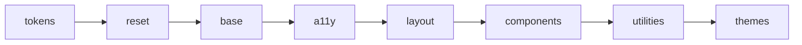

<div align="center">

<picture>
  <source media="(prefers-color-scheme: dark)" srcset=".github/assets/readme-banner-dark.svg">
  
</picture>

<br>

**WCAG 2.2 AA UI without Tailwind sprawl — modern CSS + Web Components, live in minutes.**

<br>

[](LICENSE)
[](https://github.com/SkyliteDesign/velinstyle/releases/tag/v0.8.0)
[](https://velinstyle.info/docs/)
[](https://www.npmjs.com/package/@birdapi/velinstyle)

<br>

```bash
npm i @birdapi/velinstyle
```

**[Open live demos →](https://velinstyle.info/demos/)** · **[Fork full pages →](https://github.com/SkyliteDesign/velinstyle/tree/main/showcase-demos)** · **[Docs](https://velinstyle.info/docs/)** · **[★ Star](https://github.com/SkyliteDesign/velinstyle)**

**English** · **[Deutsch](README.de.md)**

<br>

<a href="https://velinstyle.info/demos/showcase-crypto.html">
  
</a>


</div>

---

## Live demos

Full application pages — not toy snippets. Open on **[velinstyle.info](https://velinstyle.info/demos/)** or **fork** from **[velinstyle-demos](https://github.com/SkyliteDesign/velinstyle/tree/main/showcase-demos)** (zero build, unpkg CDN).

<table>
<tr>
<td width="50%" valign="top">

<a href="https://velinstyle.info/demos/showcase-crypto.html"></a>

### Crypto dashboard

Sparkline, live counter, command palette, menubar, order book — **0.8.0 motion** on a finance shell.

**[Open live demo →](https://velinstyle.info/demos/showcase-crypto.html)** · **[Fork →](https://github.com/SkyliteDesign/velinstyle/blob/main/showcase-demos/demos/showcase-crypto.html)**

</td>
<td width="50%" valign="top">

<a href="https://velinstyle.info/demos/showcase-ecommerce.html"></a>

### E-Commerce

FLIP product filter, cart sheet, mobile bottom nav, segmented sizes, live announcer.

**[Open live demo →](https://velinstyle.info/demos/showcase-ecommerce.html)** · **[Fork →](https://github.com/SkyliteDesign/velinstyle/blob/main/showcase-demos/demos/showcase-ecommerce.html)**

</td>
</tr>
<tr>
<td width="50%" valign="top">

<a href="https://velinstyle.info/demos/showcase-saas.html"></a>

### SaaS marketing

Hero, logos, feature grid, testimonial, pricing teaser — layout utilities only.

**[Open live demo →](https://velinstyle.info/demos/showcase-saas.html)** · **[Fork →](https://github.com/SkyliteDesign/velinstyle/blob/main/showcase-demos/demos/showcase-saas.html)**

</td>
<td width="50%" valign="top">

<a href="https://velinstyle.info/demos/showcase-dashboard.html"></a>

### Dashboard

App shell, KPI cards, data table, drawer-friendly actions.

**[Open live demo →](https://velinstyle.info/demos/showcase-dashboard.html)** · **[Fork →](https://github.com/SkyliteDesign/velinstyle/blob/main/showcase-demos/demos/showcase-dashboard.html)**

</td>
</tr>
<tr>
<td width="50%" valign="top">

<a href="https://velinstyle.info/demos/showcase-interactive.html"></a>

### Interactive

Modal, toast, command palette, sheet, stepper, progress ring — **32 Web Components**.

**[Open live demo →](https://velinstyle.info/demos/showcase-interactive.html)** · **[Fork →](https://github.com/SkyliteDesign/velinstyle/blob/main/showcase-demos/demos/showcase-interactive.html)**

</td>
<td width="50%" valign="top">

<a href="https://velinstyle.info/demos/showcase-forum.html"></a>

### Forum

Threads, ratings, chips, tabbed detail, mention composer.

**[Open live demo →](https://velinstyle.info/demos/showcase-forum.html)** · **[Fork →](https://github.com/SkyliteDesign/velinstyle/blob/main/showcase-demos/demos/showcase-forum.html)**

</td>
</tr>
</table>

<p align="center">
  <a href="https://velinstyle.info/demos/"><strong>All demos (UI kit + more) →</strong></a>
  &nbsp;·&nbsp;
  <a href="https://skylitedesign.github.io/velinstyle/showcase-demos/"><strong>GitHub Pages mirror →</strong></a>
</p>

---

## Why teams pick VelinStyle

- **Accessibility is structural** — focus traps, ARIA, keyboard patterns in CSS + Web Components (WCAG 2.2 AA aligned).
- **OKLCH tokens + 13 themes** — perceptual color, dark mode via `data-velin-theme`, no `dark:` sprawl.
- **Ship without a build step** — link CSS + ESM bundle; optional CLI when you want automation.

---

## Quick start

```bash
npm install @birdapi/velinstyle
```

```html
<link rel="stylesheet" href="node_modules/@birdapi/velinstyle/dist/velinstyle.min.css">
<script type="module" src="node_modules/@birdapi/velinstyle/dist/velinstyle-components.min.js"></script>

<div class="velin-container velin-p-6">
  <button type="button" class="velin-btn velin-btn--primary">Ship it</button>
</div>
```

<details>
<summary><strong>CDN · Motion snippet · Clone this repo</strong></summary>

**CDN (pinned 0.8.0):**

```html
<link rel="stylesheet" href="https://unpkg.com/@birdapi/velinstyle@0.8.0/dist/velinstyle.min.css">
<script type="module" src="https://unpkg.com/@birdapi/velinstyle@0.8.0/dist/velinstyle-components.min.js"></script>
```

**Motion (0.8.0):**

```html
<html data-velin-reveal-auto>
  <velin-live-dot status="live">Live</velin-live-dot>
  <velin-counter from="0" to="12840" duration="900"></velin-counter>
  <velin-sparkline values="3,5,4,7,9" area glow animate="draw"></velin-sparkline>
</html>
```

**Clone:** `dist/` is not in git — run `npm install && npm run build`, or use the [demos repo](https://github.com/SkyliteDesign/velinstyle/tree/main/showcase-demos) with unpkg only.

</details>

---

## vs Bootstrap · Tailwind · Shoelace

| | Bootstrap | Tailwind | Shoelace | **VelinStyle** |
| --- | :---: | :---: | :---: | :---: |
| A11y | Partial | DIY | Good WC | **WCAG 2.2 AA by design** |
| Styling | Classes | Utility JIT | Shadow WC | **CSS layers + tokens** |
| Dark mode | Manual | `dark:` | Theme attr | **Token swap** |
| App chrome | Legacy JS | BYO | WC only | **CSS + 32 Web Components** |
| Full-page demos | Basic examples | None official | Storybook | **[Live showcases](https://velinstyle.info/demos/)** |

---

## Built with VelinStyle

| | Link |
| --- | --- |
| **Product site** | [velinstyle.info](https://velinstyle.info) |
| **Documentation** | [velinstyle.info/docs/](https://velinstyle.info/docs/) |
| **Live demos** | [velinstyle.info/demos/](https://velinstyle.info/demos/) |
| **Forkable demos** | [showcase-demos/](https://github.com/SkyliteDesign/velinstyle/tree/main/showcase-demos) |
| **npm package** | [@birdapi/velinstyle](https://www.npmjs.com/package/@birdapi/velinstyle) |
| **GitHub (framework)** | [SkyliteDesign/velinstyle](https://github.com/SkyliteDesign/velinstyle) |

---

<details>
<summary><strong>CLI reference</strong> — init, build, scan, scaffold, layout, blueprint, icons</summary>

All commands: `npx velinstyle <command>` · `npx velinstyle --help`

- **`init`** · **`build`** · **`themes`** · **`add <component>`**
- **`icons list|add|build`** — multi-provider sprite workflow
- **`scan [path]`** — security, a11y, CSS lint (`--fix`, `--format json`)
- **`scaffold "…" -o page.html`** — prompt → HTML ([guide](docs/guides/prompt-scaffolding.html))
- **`layout audit|suggest|fix`** — responsive layout ([guide](docs/guides/responsive-layout.html))
- **`blueprint list`** · **`blueprint <name> -o file.html`**
- **`prefix <folder>`** · **`tokens build`**

See [CHANGELOG 0.8.0](CHANGELOG.md#080---2026-05-16) for motion, filter utilities, and new components.

</details>

<details>
<summary><strong>Architecture</strong> — layers, bundle size, local samples</summary>



Entry: [`src/velinstyle.css`](src/velinstyle.css) · **~150 KB CSS + ~111 KB JS** (min, full bundle)

**Local samples (in this repo):** [samples/](samples/) — landing, dashboard, login, kanban, RTL, a11y patterns, etc.

**Tools:** [Playground](tools/playground/index.html) · [Theme builder](tools/theme-builder/index.html)

**Starters:** [vite-velinstyle](templates/vite-velinstyle) · [vite-react-velinstyle](templates/vite-react-velinstyle)

</details>

<details>
<summary><strong>Ecosystem &amp; development</strong></summary>

```bash
npm install
npm run dev      # :3000
npm run build
npm test
npm run test:a11y
npm run demos:sync   # push showcases → velinstyle-demos repo
```

**Themes (13):** `brutalist`, `corporate`, `earth`, `forest`, `midnight`, `neon`, `nordic`, `ocean`, `pastel`, `retro`, `sharp`, `soft`, `sunset`

Maintainers: [CONTRIBUTING.md](CONTRIBUTING.md) · [SECURITY.md](SECURITY.md)

</details>

---

## Join in

1. **[Star the repo](https://github.com/SkyliteDesign/velinstyle)** — helps others discover inclusive UI tooling.
2. **Try a [live demo](https://velinstyle.info/demos/)** — then fork [velinstyle-demos](https://github.com/SkyliteDesign/velinstyle/tree/main/showcase-demos).
3. **Open an issue or PR** — we read everything.

---

## License

[MIT](LICENSE) — Copyright © 2026 VelinStyle

<div align="center">

Made with care for the web by [SkyliteDesign](https://github.com/SkyliteDesign)


</div>
