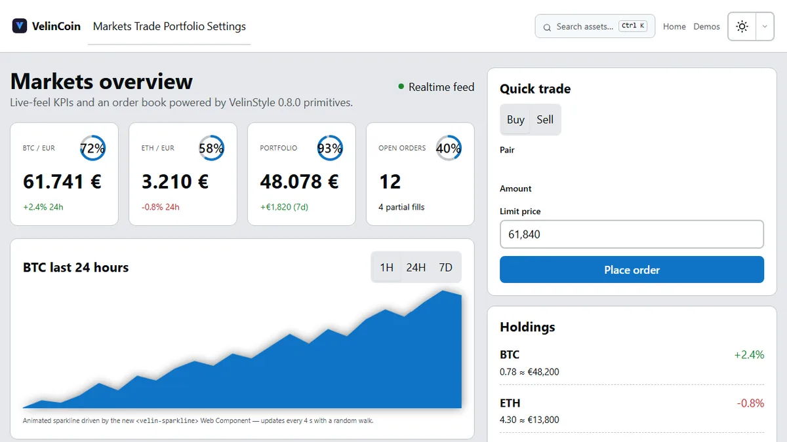

<div align="center">

```
██╗   ██╗███████╗██╗     ██╗███╗   ██╗███████╗████████╗██╗  ██╗██╗     ███████╗
██║   ██║██╔════╝██║     ██║████╗  ██║██╔════╝╚══██╔══╝██║  ██║██║     ██╔════╝
██║   ██║█████╗  ██║     ██║██╔██╗ ██║███████╗   ██║   ███████║██║     █████╗
╚██╗ ██╔╝██╔══╝  ██║     ██║██║╚██╗██║╚════██║   ██║   ██╔══██║██║     ██╔══╝
 ╚████╔╝ ███████╗███████╗██║██║ ╚████║███████║   ██║   ██║  ██║███████╗███████╗
  ╚═══╝  ╚══════╝╚══════╝╚═╝╚═╝  ╚═══╝╚══════╝   ╚═╝   ╚═╝  ╚═╝╚══════╝╚══════╝
```

**Accessibility-first CSS Framework · Web Components · Design Intelligence · AI Workflows**

One framework. One CLI. One design system. One AI-ready ecosystem.

[](LICENSE)
[](https://www.npmjs.com/package/@birdapi/velinstyle)
[](https://www.npmjs.com/package/@birdapi/velinstyle)
[](https://github.com/SkyliteDesign/velinstyle/stargazers)
[](https://nodejs.org/)
[](https://velinstyle.info/docs/getting-started/introduction.html)
[](https://velinstyle.info/docs/getting-started/accessibility.html)
[](CONTRIBUTING.md)

```bash
npm i @birdapi/velinstyle
```

**[Website](https://velinstyle.info)** · **[Docs](https://velinstyle.info/docs/getting-started/introduction.html)** · **[Demos](https://velinstyle.info/demos/)** · **[Getting Started](GETTING_STARTED.md)** · **[Architecture](ARCHITECTURE.md)** · **[Deutsch](README.de.md)**

</div>

---

VelinStyle is a **production CSS + Web Components framework** with **WCAG 2.2 AAA-oriented defaults**, a real **CLI ship surface**, and the first **Design Intelligence / AI Foundation** systems (beta). No external UI framework in the core.

**Best fit today:** marketing landings, docs shells, simple admin starters.  
**Not yet:** sole primary stack for large multipage shop + enterprise admin without custom work.

> **Release:** **1.2.0** (Core + Design Intelligence Foundation + Trust/Ship). Using VelinStyle does **not** certify your app — see the [a11y matrix](https://velinstyle.info/docs/getting-started/accessibility.html).

---

## Why VelinStyle

| Need | What you get |
|------|----------------|
| Readable HTML | Semantic BEM (`velin-btn--primary`), not utility walls |
| Accessibility | AAA-capable tokens, focus management, reduced motion — built in |
| Ship without a build | CDN CSS + optional WCs; Vite/React when you want them |
| Predictable overrides | Cascade layers + OKLCH design tokens |
| Quality gates | `scan`, `review`, `check` — catch real defects before merge |
| AI that helps | Skills, workflows, and agent metadata — **Mensch → Framework → KI** |

Compared to **Tailwind**: less class sprawl, stronger defaults for contrast and semantics.  
Compared to **Bootstrap**: modern tokens/layers, optional progressive WCs, CLI automation instead of jQuery-era chrome.

---

## Feature highlights

| | Area | What it does |
|---|------|----------------|
| 🎨 | **CSS Framework** | OKLCH themes, utilities, components, lite preset for marketing budgets |
| 🧩 | **Web Components** | 40 canonical custom elements; use CSS alone when you need no JS |
| ⚡ | **Runtime** | Search, motion, highlight, attributes, `bootFromDOM` tree-shaking |
| 🛠 | **CLI** | `create` · `serve` · `doctor` · `check` · `scan` · `review` · `skills` |
| 🧠 | **Design Intelligence** | Plan → constraints → page/section registry → review (beta) |
| 🤖 | **AI Skills** | 40 skills, packs, bundles, templates, workflow graphs (beta) |
| 📦 | **Registry** | Skills + page/section registries as machine-readable contracts |
| 📄 | **AI Metadata** | `velin-agent.json`, `llms.txt`, page-level agent JSON |
| 📚 | **Documentation** | Dogfooded site — 100% VelinStyle |
| 🔍 | **Review Engine** | Heuristic design / a11y / SEO / conversion gates (beta) |
| 🛡 | **Scan Engine** | A11y, security, CSS honesty, PII |
| 🚀 | **Performance** | Lite CSS, chunked runtime, CLS placeholders |
| ♿ | **Accessibility** | Contracts, WCAG 2.2 tooling, keyboard + ARIA patterns |

---

## What's new in 1.2

Not a CSS bump — a **foundation release**.

- **Ship surface** — `create landing|dashboard|docs|auth`, `serve`, `doctor`, `check` (`--json` / `--sarif`)
- **Design Intelligence (beta)** — Prompt Engine (`plan`), Review Engine, knowledge graph seed, design constraints
- **AI Foundation (beta)** — skill engine, workflows, richer agent metadata
- **New primitives** — `<velin-calendar>`, `<velin-file-dropzone>`, editable `<velin-data-table>`
- **Trust gates** — stricter scan/review so junk pages cannot fake green scores

Details: [`RELEASE_NOTES_1.2.0.md`](RELEASE_NOTES_1.2.0.md) · full history: [`CHANGELOG.md`](CHANGELOG.md)

---

## Installation

```bash
npm i @birdapi/velinstyle
pnpm add @birdapi/velinstyle
yarn add @birdapi/velinstyle
bun add @birdapi/velinstyle
```

**CDN** (pin a version):

```html
<link rel="stylesheet" href="https://unpkg.com/@birdapi/velinstyle@1.2.0/dist/velinstyle.min.css">
<script type="module" src="https://unpkg.com/@birdapi/velinstyle@1.2.0/dist/velinstyle-components.min.js"></script>
```

> Pin **`@1.2.0`** (or `@latest` after publish). Examples above match this package version.

| Export | Use |
|--------|-----|
| `@birdapi/velinstyle/css` | Full stylesheet |
| `@birdapi/velinstyle/bundle` | Web Components ESM |
| `/search` `/motion` `/attributes` `/highlight` `/meta` `/sanitize` | Tree-shakeable modules |

After clone: `npm install && npm run build` — `dist/` is generated, not committed.

---

## Quick start

```html
<!DOCTYPE html>
<html lang="en" data-velin-theme="ocean">
<head>
  <meta charset="UTF-8">
  <meta name="viewport" content="width=device-width, initial-scale=1">
  <link rel="stylesheet" href="https://unpkg.com/@birdapi/velinstyle@1.2.0/dist/velinstyle.min.css">
  <script type="module" src="https://unpkg.com/@birdapi/velinstyle@1.2.0/dist/velinstyle-components.min.js"></script>
</head>
<body class="velin-p-6">
  <button type="button" class="velin-btn velin-btn--primary">Ship it</button>
  <velin-toast></velin-toast>
</body>
</html>
```

Scaffold + gate (local 1.2 tree / after publish):

```bash
npx @birdapi/velinstyle create landing ./my-site
cd my-site && npx @birdapi/velinstyle serve . && npx @birdapi/velinstyle check .
```

More: [`GETTING_STARTED.md`](GETTING_STARTED.md)

---

## CLI

| Command | Role |
|---------|------|
| `init` | Project config |
| `create` | Opinionated scaffolds (`landing` · `dashboard` · `docs` · `auth`) |
| `build` | CSS build (`--preset lite` for marketing) |
| `serve` | Static preview |
| `doctor` | Install / path health |
| `check` | doctor + blueprints + scan + review |
| `scan` | A11y / security / CSS / PII |
| `review` | Design-intelligence gate (beta) |
| `plan` | Prompt → plan JSON → render (beta) |
| `skills` / `workflow` | AI skill registry & graphs (beta) |
| `meta` | Agent bundle + `llms.txt` |
| `wc api <tag>` | Human-readable WC API from source |

```bash
npx @birdapi/velinstyle check . --profile marketing
npx @birdapi/velinstyle wc api velin-toast
```

---

## AI Skills & Design Intelligence

**AI Skills** give agents and humans a shared vocabulary: skill records, packs, bundles, templates, and workflow graphs. They exist so tooling can scaffold, review, and ship **without inventing VelinStyle from scratch**.

**Design Intelligence** adds structure ordinary CSS frameworks lack: a knowledge graph seed, page/section registries, design constraints, and `plan` / `review` so pages are assembled from known patterns — then checked against profiles (`marketing` · `app` · `docs` · `ecommerce`).

Deep dive: [`ARCHITECTURE.md`](ARCHITECTURE.md) · [`VELINSTYLE_2030.md`](VELINSTYLE_2030.md) · Strategy (lokal, nicht im Git): [`docs/strategy/README.md`](docs/strategy/README.md)

---

## Components

**40 canonical** custom elements (**42** lazy-loader entries including legacy `*-wc` aliases).

Philosophy: **progressive enhancement** — semantic HTML + CSS first; upgrade to a Web Component only when you need behavior (focus traps, sorting, offline search).

Highlights: `velin-modal`, `velin-drawer`, `velin-search`, `velin-data-table`, `velin-form-summary`, `velin-calendar`, `velin-file-dropzone`, `velin-toast`, `velin-code-block`.

React: [`@velinstyle/react`](./packages/react/README.md) wraps every canonical tag.

---

## Accessibility

Accessibility is a **default**, not a plugin.

- WCAG 2.2 **AAA-oriented** token defaults (`data-velin-contrast="aa"` when you need the lighter palette)
- Semantic HTML patterns and BEM components
- Keyboard support, focus management, `inert` overlays
- `prefers-reduced-motion` gating
- Component a11y contracts + scanner rules

Docs: [a11y matrix](https://velinstyle.info/docs/getting-started/accessibility.html) · AAA marketing language: see `VELINSTYLE_2030.md` (strategy ADRs are local-only)

---

## Documentation map

| Layer | File / link | Audience |
|-------|-------------|----------|
| Landing | This README | First 30 seconds |
| First build | [`GETTING_STARTED.md`](GETTING_STARTED.md) | New adopters |
| FAQ | [`FAQ.md`](FAQ.md) | Common questions |
| Troubleshooting | [`TROUBLESHOOTING.md`](TROUBLESHOOTING.md) | When stuck |
| Deploy | [`DEPLOY.md`](DEPLOY.md) | Ship to production |
| Systems | [`ARCHITECTURE.md`](ARCHITECTURE.md) | Advanced / AI / DI |
| Design Intelligence | [`docs/guides/design-intelligence.md`](docs/guides/design-intelligence.md) | Plan / review |
| CLI ship surface | [`docs/guides/cli-ship-surface.md`](docs/guides/cli-ship-surface.md) | create / check / wc |
| AI Skills | [`docs/guides/ai-skills.md`](docs/guides/ai-skills.md) | Skills / workflows |
| Product site | [velinstyle.info/docs](https://velinstyle.info/docs/getting-started/introduction.html) | Guides, demos, reference |
| Upgrade | [`UPGRADING.md`](UPGRADING.md) | 1.1 → 1.2 |
| North star | [`VELINSTYLE_2030.md`](VELINSTYLE_2030.md) | Long-term vision |

---

## Repository structure

```
velinstyle/
├── src/                 # CSS source (tokens, base, components, utilities)
├── components/          # Web Components (JS)
├── core/                # Runtime: search, motion, highlight, attributes, meta
├── cli/                 # velinstyle binary
├── packages/            # React wrappers, skill-engine, skills registry
├── schemas/             # Design Intelligence + skill contracts
├── docs/                # Docs + strategy ADRs
├── samples/             # Local HTML samples
├── templates/           # Starters (e.g. Vite + React)
├── fixtures/            # Scanner / chaos fixtures
└── showcase-demos/      # Full-page demos
```

---

## Philosophy

**Mensch → Framework → Design Intelligence → AI**

Humans own product intent. The framework ships reliable CSS and components. Design Intelligence encodes patterns and constraints. AI skills and workflows accelerate scaffolding and review — they **support** developers; they do not replace judgment, accessibility ownership, or design responsibility.

---

## Roadmap (maturity)

| Status | Surfaces |
|--------|----------|
| **Stable** | CSS · Utilities · Runtime · Web Components · CLI core · Blueprints |
| **Beta** | Review Engine · Prompt Engine · Knowledge Graph · AI Metadata · Design Constraints |
| **Foundation** | AI Skills · Workflow Graphs · Registries |
| **Planned** | Studio · Utility Engine Generator |

---

## Comparison

| | Bootstrap | Tailwind | **VelinStyle** |
|---|:---:|:---:|:---:|
| HTML readability | Medium | Low | **High** |
| Utility sprawl | Low | High | **Controlled** |
| A11y defaults | Partial | DIY | **AAA-capable tokens** |
| Dark mode | Manual | `dark:` everywhere | **Token swap** |
| Build required | No | Usually | **CDN optional** |
| Design / AI gates | — | — | **plan · review · skills** |

---

## Contributing

1. Fork → `npm install && npm run build`
2. Change code · run `npm test`, `npm run test:a11y`, `npm run test:e2e`
3. Open a PR

See [`CONTRIBUTING.md`](CONTRIBUTING.md).

---

## License

[MIT](LICENSE) — © 2026 VelinStyle · [SkyliteDesign](https://github.com/SkyliteDesign)

<p align="center">
  <a href="https://velinstyle.info/demos/showcase-crypto.html">
    
  </a>
</p>
